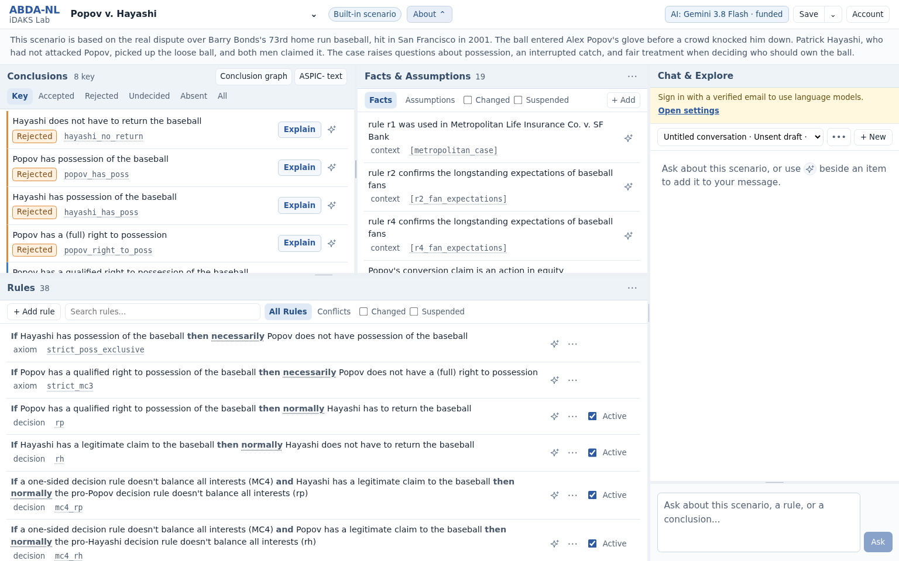

<div align="center">

# ABDA-NL

### Explore argument-based reasoning in plain language

ABDA-NL turns facts, assumptions, and rules into arguments you can inspect,
question, and revise in your browser.

<p>
  <a href="https://demo.abda-nl.org/"><strong>Open the live demo</strong></a>
  &nbsp;·&nbsp;
  <a href="docs/scenarios.md">Create a scenario</a>
  &nbsp;·&nbsp;
  <a href="CITATION.cff">Cite the project</a>
</p>

<p>
  <a href="https://demo.abda-nl.org/"></a>
  <a href="https://github.com/idaks/ABDA-NL/actions/workflows/ci.yml"></a>
  
  <a href="LICENSE"></a>
</p>

</div>

> [!TIP]
> **Try it now at [demo.abda-nl.org](https://demo.abda-nl.org/).** You can
> explore the built-in and community scenarios immediately. Registration with
> an email code takes about 30 seconds. The first 100 registered users can
> activate **$5 of free AI credit**, enough for roughly 200 typical LLM calls.
> The exact number depends on the chosen model and the length of each exchange.



ABDA-NL makes structured argumentation approachable without hiding the formal
reasoning underneath. The ABDA engine computes the arguments, attacks, and
conclusion labels. The optional AI assistant helps explain those results in
natural language, find relevant source passages, and draft changes for human
review.

## What you can do

| | |
|---|---|
| **Follow the reasoning** | See which conclusions are accepted, rejected, undecided, or absent, then inspect the supporting and attacking arguments. |
| **Ask what changed** | Toggle assumptions and defeasible rules, preview the effects, reset the scenario, or undo the reset. |
| **Talk with the scenario** | Ask grounded questions, open highlighted evidence, stop a slow response, retry an answer, or edit and fork the conversation. |
| **Build your own case** | Create a scenario in a guided editor, write ASPIC- rules directly, or import YAML and JSON. |
| **Bring source material** | Attach text, Markdown, and text-based PDFs as context for explanations and citations. |
| **Keep work portable** | Save private scenarios, share a read-only view, publish a community scenario, or export a self-contained JSON file. |
| **Work through an agent** | Connect Codex or Claude Code through scoped MCP access to inspect, create, import, and revise scenarios. |
| **Present without an LLM** | Choose **AI off** and keep the complete deterministic explorer available. |

The interface is designed for argumentation researchers, students, teachers,
and anyone curious about how reasons support or challenge a conclusion. You do
not need to know ASPIC- notation to begin.

## A two-minute tour

1. Open the [live demo](https://demo.abda-nl.org/) and choose a scenario from
   the title menu.
2. Select **Explain** beside a conclusion to inspect its derivation.
3. Change an assumption or rule and preview how the conclusion labels respond.
4. Ask the AI assistant why a conclusion holds, or request supporting sources.
5. Open **New scenario** or **Import scenario file** when you are ready to try
   your own example.

AI is optional throughout this flow. It can describe the formal result and
suggest edits, but it never decides which conclusions follow. Proposed edits
must pass validation and remain under the user's control.

## AI access

Gemini 3.8 Flash is the default funded model because it offers a strong balance
of capability, speed, and cost. Other qualified Gemini, Claude, and GPT models
are available from the same menu.

For registered users, CloudBank supplies the primary funded route. Eligible
provider outages can fall back to the same model through OpenRouter. You can
also bring your own Anthropic, OpenAI, Google, or OpenRouter key. A personal key
stays in the current browser tab and is not stored by the service.

Choose **AI off** from the model menu, or from **Account > AI access**, for a
manual presentation. Scenario exploration, formal explanations, editing,
import, and export continue to work without a model call.

## Create, import, and share scenarios

The guided editor lets you describe statements and connect them with strict or
defeasible rules. The Rule text view exposes the corresponding ASPIC- syntax.
Both views edit the same knowledge base.

You can add reference documents, preview computed results before saving, and
export the complete scenario with its glossary and source text. Imports accept
complete ABDA-NL YAML or JSON files, as well as separate rules, glossary files,
and supporting documents.

See [Your own scenarios](docs/scenarios.md) for a short walkthrough and the
supported formats.

## Run locally

ABDA-NL supports Python 3.10 through 3.13.

```bash
git clone https://github.com/idaks/ABDA-NL.git
cd ABDA-NL
python3 -m venv .venv
make install
.venv/bin/abda-nl
```

The last command starts the app on your computer and opens a browser. When no
LLM configuration is present, it starts as a complete deterministic demo. You
can also choose the mode explicitly:

```bash
.venv/bin/abda-nl --basic       # deterministic explorer, no LLM
.venv/bin/abda-nl --llm         # require configured LLM access
.venv/bin/abda-nl --no-browser  # start without opening a browser
```

For development and tests:

```bash
make install-dev
make test
```

On NCSA Delta, run `demo`. The shared launcher manages the process and the
loopback tunnel described in this repository's `AGENTS.md`.

## Guides for deeper use

- [Scenario authoring, imports, and exports](docs/scenarios.md)
- [Codex and Claude Code through MCP](docs/operations/mcp-subscription-workflow.md)
- [COMMA 2026 demonstration playbook](docs/operations/comma-2026-demo-playbook.md)
- [Model selection and routing](docs/decisions/0003-model-routing-and-cost-controls.md)
- [Architecture and design decisions](docs/decisions/)
- [Service operation and deployment](docs/operations/README.md)
- [PostgreSQL backup and recovery](docs/operations/database-recovery.md)

If you consider ABDA-NL useful for research, teaching, or exploration, please
**star ⭐ this repository**. It helps other people find the project.

## Research and citation

ABDA-NL was created by Shawn Bowers, Martin Caminada, Haoyang Liu, and Bertram
Ludäscher for the COMMA 2026 demonstration track. Citation metadata is provided
in [`CITATION.cff`](CITATION.cff).

The project combines a natural-language workspace with the
[ABDA engine](https://github.com/Schirmi136/ABDA) for deterministic
argumentation semantics. See [`THIRD_PARTY_NOTICES.md`](THIRD_PARTY_NOTICES.md)
for component attribution and corresponding-source information.

## License

This distribution is licensed under
[GNU GPL version 3](LICENSE) (`GPL-3.0-only`). The original MIT notice is
preserved in [`LICENSES/ABDA-NL-MIT.txt`](LICENSES/ABDA-NL-MIT.txt). The paper
and cited research material are not relicensed by this repository.
